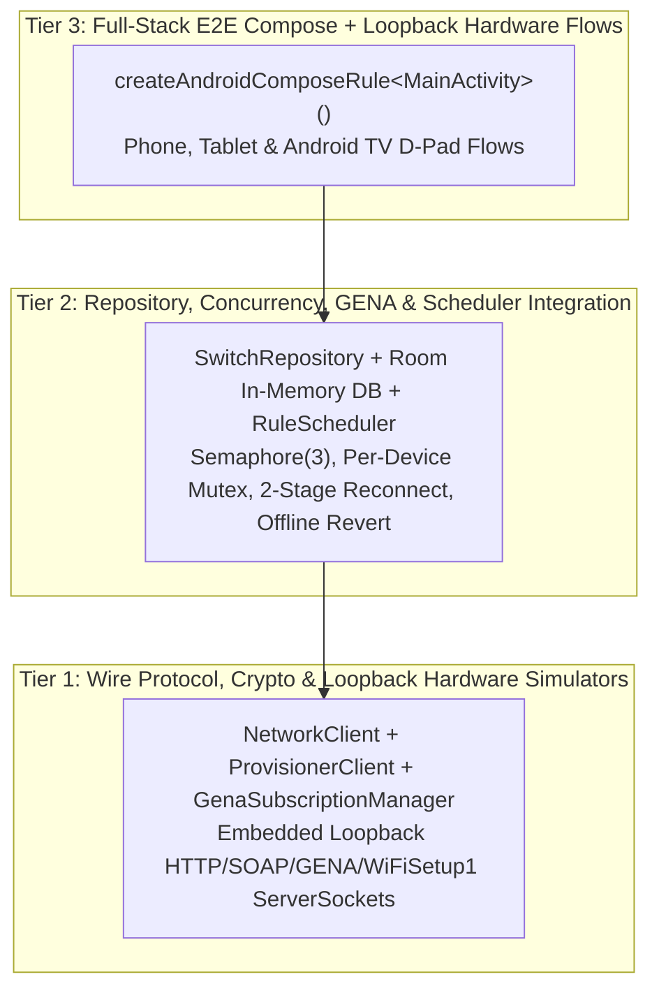

# Android End-to-End (E2E) Testing & Implementation Validation Skill

Use this skill when designing, writing, refactoring, or executing unit, protocol, and end-to-end (E2E) UI tests for Android and Android TV applications (including `MichaelRHead/WeMi-light-control`).

---

## 1. Testing Philosophy: Hermetic, Fast, Full-Stack Validation

For a local-LAN hardware controller app, mocking `SwitchRepository` or `NetworkClient` with synthetic stubs hides the bugs that matter most in production (socket timeouts, UPnP port shifts, XML quirks, concurrency deadlocks, and optimistic UI rollback).

Instead, follow a **3-Tier Hermetic Testing Pyramid** that runs deterministically on the JVM via JUnit 4 + Robolectric + Jetpack Compose UI Test (`./gradlew testDebugUnitTest`) in seconds without requiring physical switches or an external emulator:


```mermaid
flowchart TD
    subgraph Tier3["Tier 3: Full-Stack E2E Compose + Loopback Hardware Flows"]
        UI["createAndroidComposeRule&lt;MainActivity&gt;()\nPhone, Tablet & Android TV D-Pad Flows"]
    end
    subgraph Tier2["Tier 2: Repository, Concurrency, GENA & Scheduler Integration"]
        Repo["SwitchRepository + Room In-Memory DB + RuleScheduler\nSemaphore(3), Per-Device Mutex, 2-Stage Reconnect, Offline Revert"]
    end
    subgraph Tier1["Tier 1: Wire Protocol, Crypto & Loopback Hardware Simulators"]
        Net["NetworkClient + ProvisionerClient + GenaSubscriptionManager\nEmbedded Loopback HTTP/SOAP/GENA/WiFiSetup1 ServerSockets"]
    end
    UI --> Repo --> Net
```

---

## 2. Modular Test Suite Organization (`app/src/test/java/org/suppressingfire/wemi/` — All Files `< 500` Lines)

Never let a single test file exceed `500` lines. Organize tests by architectural responsibility (targeting **150–480 lines per test file**) with shared loopback hardware fixtures:

1. **Shared Loopback Hardware & Compose Polling Fixtures (`FakeUpnpServer.kt` & `ComposeLoopbackTestUtils.kt`)**:
   - `FakeUpnpServer.kt` (`480L`) encapsulates a lightweight `ServerSocket(0)` and `DatagramSocket(0)` bound to `127.0.0.1` that simulates a real Belkin WeMo switch, dimmer, motion sensor, or `10.22.22.1` setup AP (`GetBinaryState`, `SetBinaryState` with `<BinaryState>Error</BinaryState>` quirk mode, `GetMetaInfo`, `GetSignalStrength`, `ConfigureNightMode`, `ChangeFriendlyName`, `SUBSCRIBE /upnp/event/basicevent1` with HTTP 412 expiry, UDP SSDP `M-SEARCH`, and `WiFiSetup1`), including simulated **port shifting** and **DHCP IP swap hazards**.
   - `ComposeLoopbackTestUtils.kt` (`49L`) provides shared `awaitLoopbackIo(timeoutMs)` wall-clock pumping and `hasTestTagPrefix(prefix)` semantic matchers across all Compose E2E suites.
2. **Tier 1 — Pure Wire Helpers, SKU Classification, Crypto, Scheduler & Client Probing (`ExampleUnitTest.kt`, `SkuAndCryptoTest.kt`, `RuleAndTransportTest.kt` & `SoapAndSelfHealingTest.kt`)**:
   - `ExampleUnitTest.kt` (`490L`): Pure JVM unit tests for `XmlAndSkuParser.buildSoapEnvelope` / `escapeXml` / `parseBinaryStatePayload`, `LanRuntimeUtils.isPlaceholderSerial` & `canonicalHardwareUdn`, `DeviceEntity.matchesDiscovered` (3-tier identity + placeholder-serial fallthrough), `DeviceEntity.concurrencyKey()`, `RuleType`, `TvScene`, Play Console R8 `EdgeToEdge*` / `SystemBarStyle*` keep rules, cloud Auto-Backup telemetry exclusions (`backup_rules.xml` & `data_extraction_rules.xml`), optional `android.hardware.wifi` manifest declarations, `100755` (`+x`) executable script permission guards, `DeviceDescriptorFetcher` `"UNKNOWN"` serial preservation, `NetworkStatus=2` short-vs-long password remediation, and `TelemetryFileExporter` `<password>` redaction.
   - `SkuAndCryptoTest.kt` (`329L`): Validates `classifyHardwareSku` (`F7C030`, `WLS040`/`WLS0403`, `F7C059`/`WDS060`, `F7C063`/`WSP080`), `parseSetupXmlDescriptor`, `isWemoDeviceSetupSsid`, `classifyDeviceCategory`, `inferRoomFromName` / `resolveDeviceRoomAssignment`, and `minSdk 24`-safe (`kotlin.io.encoding.Base64`) OpenSSL `EVP_BytesToKey` AES-128-CBC round-trip `encryptWifiPassword` / `decryptWifiPassword` (Methods 1, 2, and 3).
   - `RuleAndTransportTest.kt` (`251L`, `4` tests): Validates deterministic `RuleScheduler` injected-clock evaluation (`evaluateScheduledRulesNow`), minute deduplication, next-day rollover, rule fault isolation & strict `parseScheduleTime24h` range validation, `NetworkClient` brightness/night-mode clamping & `socketFactoryOverride` injection, `LanHttpClient` edge cases (`204 No Content`, chunked extension + trailers, malformed status `EOFException`, missing host `IllegalArgumentException`), and `SwitchViewModel` injected-repository constructor seam + `normalizeRoomName` consistency.
   - `SoapAndSelfHealingTest.kt` (`482L`): Validates `LanHttpClient` HTTP/1.1 framing (`Content-Length`, `Transfer-Encoding: chunked`, and missing-`Content-Length` + delayed-`FIN` recovery), `NetworkClient.probeWemoPort` 9-port port-shift healing + `<serialNumber>` mismatch guard, Stage B placeholder-serial unicast isolation & `10.22.22` Setup AP sweep skip, manual-IP `saveDevice` `<serialNumber>`/`<UDN>` deduplication & blank-name `<friendlyName>` preservation, inside-lock `executeSsdpScan` concurrent DB edit preservation & post-deletion monotonic `sortOrder`, `"Unassigned"` blank-`roomName` power/brightness fan-out + `saveOrUpdateHomeNetwork` `sortOrder` preservation + GENA superseded-SID eviction, `<BinaryState>Error</BinaryState>` handling, `GetMetaInfo`, `ChangeFriendlyName`, `ConfigureNightMode`, and `GetSignalStrength`.
3. **Tier 2 — Repository Concurrency, Discovery/Grouping, Lifecycle, Self-Healing, Provisioning & License Governance (`RepositorySelfHealingTest.kt`, `BatchAndCrudIntegrationTest.kt`, `DiscoveryAndGroupingIntegrationTest.kt`, `LifecycleAndConcurrencyTest.kt`, `GenaProvisioningAndRulesTest.kt` & `LicenseAndBrandGovernanceTest.kt`)**:
   - **Startup State Detection & Self-Healing (`RepositorySelfHealingTest.kt`, `477L`)**: Parallel `detectStartupDeviceStates` (`ON`, `OFF Accessible Standby`, `Disconnected`), manual-IP `saveDevice` 9-port probing, per-home startup soft-AP SSID sanitization, `resetLanHomesSwitchesAndRooms`, Real LAN Mode offline revert, `toggleDimmerNightMode` 9-port self-healing + offline rollback, and `pollActiveHomeStates` `2000ms` echo suppression.
   - **Concurrent `Semaphore(3)` Batch Operations, Multi-Switch GENA Routing, Queued Double-Toggles, Home/Room Reordering & Demo `saveDevice` Fast-Path (`BatchAndCrudIntegrationTest.kt`, `482L`)**: Validates concurrent `toggleRoomPower` and idempotent `turnAllSwitches` across 4 loopback `FakeUpnpServer` switches (`maxActive <= 3`), parallel `pollActiveHomeStates` and single-pass `reconnectAndRediscoverHome`, immediate Real-LAN `SUBSCRIBE /upnp/event/basicevent1` registration on `SwitchViewModel.adoptSsdpDevice` + `statusBannerJob` timer reset, multi-switch GENA `NOTIFY` routing on shared `127.0.0.1` + placeholder-serial `"dev_${id}"` isolation + `deleteDevice`/reset GENA cleanup, rapid back-to-back `toggleDevicePower` double-toggles (`OFF -> ON -> OFF`) + port-heal preservation, home/room-scoped `moveDeviceOrder`, and instant Demo Showroom `saveDevice` completion (`< 500ms`) without live TCP probes on synthetic `192.168.1.x` IPs.
   - **Canonical Tier-2 `<UDN>` Discovery & Room Grouping (`DiscoveryAndGroupingIntegrationTest.kt`, `444L`)**: Validates `expectedHardwareIdentity`, Tier-2 UDN mismatch & blank-serial `probeWemoPort` / `executeWithPortHealing`, Stage C multicast-zero fallback policy (`shouldRunUnicastSubnetFallback`), strict 4-pass `findMatchingExistingDevice` factory-name isolation, non-clobbering reconnect router-SSID sync + soft-AP re-adoption preservation, and blank-serial manual-IP UDN deduplication + trimmed `moveDeviceOrder`.
   - **Lifecycle, Coroutine Cancellation & State-Transition Safety (`LifecycleAndConcurrencyTest.kt`, `469L`)**: Validates `RuleScheduler` orphan-timer pruning, `AUTO_OFF` schedule exclusion & job-identity replacement guards, `HomeAndRulesUiController` superseded reconnect cancellation, `DeviceCrudAndRulesCoordinator` per-device mutex `saveDevice` live-metadata merge & healed rename port persistence, `HomeProfileSanitizer` atomic adoption counting, `ProvisioningCoordinator` `DEFAULT_FALLBACK_MAC` preservation, `GenaSubscriptionManager` placeholder eviction & brightness-only logs, and suspend `CancellationException` propagation.
   - **UPnP GENA Push, Multi-Byte UTF-8 Byte-Framing, Non-Resetting `RuleScheduler` & Zero-Cloud `WiFiSetup1` Provisioning (`GenaProvisioningAndRulesTest.kt`, `488L`)**: Verifies `SUBSCRIBE`, HTTP 412 recovery, byte-exact `Content-Length` framing on multi-byte UTF-8 `<e:propertyset>` `NOTIFY` payloads (`<100ms`), `RuleScheduler` countdown preservation across health polls, and full loopback `probeSetupDevice` → `GetApList`/`GetNetworkList` → double `ConnectHomeNetwork` → `GetNetworkStatus` multi-poll → `CloseSetup` + `SetSetupDoneStatus` → automatic Room device insertion + `BuildConfig` telemetry version stamping.
   - **MIT License, Dependency Footprint & Brand Hygiene (`LicenseAndBrandGovernanceTest.kt`, `338L`)**: Verifies word-for-word root `LICENSE` parity with `MoreScreen.kt`, minimal `Apache-2.0` dependency footprint (zero external HTTP/font/JNI `.so` bloat), `org.suppressingfire.wemi` package/filename hygiene, and Play Store trademark boundaries.
4. **Tier 3 — End-to-End Compose UI, Home Screen Widget & User Journey Tests (`ExampleRobolectricTest.kt`, `EndToEndUiTest.kt`, `HardwareCujEndToEndTest.kt`, `ProvisioningAndGenaCujE2ETest.kt`, `TvAndHeaderLayoutE2ETest.kt`, `TvNavigationAndScenesE2ETest.kt`, `HomeScreenWidgetTest.kt`, `HomeScreenWidgetUiE2ETest.kt` & `AppFlowsAndManagementE2ETest.kt`)**:
   - Uses `createAndroidComposeRule<MainActivity>()`, `ActivityScenario`, and `ShadowAppWidgetManager` to validate complete human user journeys (`90/90` total tests across `19` suites):
     - **Journey A & B (`ExampleRobolectricTest.kt` `345L` & `EndToEndUiTest.kt` `454L`)**: Multi-Home & Room Master control, 3-state visual semantics (`ON`, `OFF Accessible Standby`, `Disconnected`), semantic category badges, live `Auto-Off M:SS` countdown badge (`auto_off_countdown_${id}`), grouped-by-room `Move Up` / `Move Down` reordering (`move_up_${id}`), edit/manual-add dialogs (including blank-name `<friendlyName>` NVRAM preservation), and Rules CRUD.
     - **Journey C & E (`ProvisioningAndGenaCujE2ETest.kt` `421L`)**: Zero-cloud `10.22.22.1` Setup AP hardware scan + AES Method 2 provisioning + `[TARGET AP]` telemetry export (`copy_provision_debug_button`), Disconnected 9-port self-healing reconnect ring + GENA `NOTIFY` push UI transition + Live SOAP Log export (`export_telemetry_file_button`), `"Unassigned"` room dimmer fan-out + `HomeNetworkEntity` `sortOrder` preservation + GENA superseded-SID eviction, and Real-LAN `"UNKNOWN"`-serial setup-AP-to-SSDP in-place merge.
     - **Journey D (`HardwareCujEndToEndTest.kt` `297L`)**: Full-stack `Reset` → loopback UDP `SSDP Discovery` → `Adopt Switch & Dimmer` → `Toggle Switch` → `Toggle & Scale Dimmer Brightness` (`75%`, `21%`, `Slider`, `Night Mode 20%`, Room Master slider).
     - **Journey F & G (`TvAndHeaderLayoutE2ETest.kt` `401L` & `TvNavigationAndScenesE2ETest.kt` `342L`)**: `>= 48.dp` accessible single-row `TopHeader` (`all_off_devices_button`, `Role.Button`, `ContentDescription`), 1080p `w960dp-h540dp-land-television-xhdpi` `TvTopHeaderBar` dimmer-focus packing geometry, plus native `@Config(sdk = [36], qualifiers = "television")` 3-column room-grouped D-Pad navigation, consecutive `Key.DirectionCenter` `OFF -> ON -> OFF -> ON` toggles, focusable inline Dimmer Slider (`tv_card_dim_mode_${id}` + rapid back-to-back `Left`/`Right` steps + `Key.Back`), multi-row column memory (`Col 2` preserved across rows/room headers), empty-home initial focus on `tv_scan_button` + post-`Rescan` `DirectionDown` traversal from top-bar chips, consecutive Room Header `Left`/`Right` `-10%`/`+10%` room dimmer stepping, `"Unassigned"` blank-`roomName` Room Header toggle/dimming, and TV Scenes (`Movie 20%`, `Holiday ON`, `All OFF`).
     - **Journey H — Home Screen Light & Room Widgets (`HomeScreenWidgetTest.kt` `490L`, `6` tests & `HomeScreenWidgetUiE2ETest.kt` `483L`, `3` tests)**: Validates `WidgetConfigStore` persistence/deletion/overlapping-ID `remapIds` (`[101, 102] -> [102, 103]` & swap), `WidgetRemoteViewsBuilder` serial-first anti-hijack resolution, strict multi-home Room isolation & unconfigured/missing/offline states, `WeMiSwitchWidgetProvider` broadcast lifecycle (`ACTION_WIDGET_PINNED` with negative-ID rejection & `"UNKNOWN"` placeholder-serial stripping, `ACTION_TOGGLE_WIDGET`, `onRestored`, `onDeleted`) + offline Room wake-up, headless `WidgetActionExecutor` per-widget `Mutex` rapid double-tap serialization (`OFF -> ON -> OFF`), post-reset Room `networkKey` & learned-serial healing over loopback `FakeUpnpServer`, plus full zero-mock Home Screen installation & live usage E2E in `HomeScreenWidgetUiE2ETest.kt` (`SwitchWidgetConfigureActivity` Room/Light/Reconfiguration across homes, empty Real-LAN state, invalid ID & Cancel; in-app one-tap `AppWidgetManager.requestPinAppWidget` pinning + unsupported fallback + motion-sensor exclusion; tapping actual inflated `RemoteViews` `PendingIntent`s over loopback UPnP SOAP; bi-directional `MainActivity` live sync; headless 9-port offline dimmer recovery; orphaned widget reconfigure `PendingIntent`; and `ACTION_APPWIDGET_DELETED` cleanup).
     - **Journey I — App Management, Navigation, Bulk SSDP, Motion-Dimmer Rules & 10-Inch Tablet Layout (`AppFlowsAndManagementE2ETest.kt` `454L`, `4` tests)**: Validates Multi-Home `AddWifiHomeNetworkDialog`, Room collapse/expand (`room_collapse_button_*`), Room filter + Flat List toggle (`room_filter_*`, `toggle_group_by_room_chip`), context-sensitive `+` / `Edit` header routing, multi-layer `MainActivity` `BackHandler` unwinding, Real-LAN `ChangeFriendlyName` toggle ON vs. OFF + custom room reassignment + Edit-Mode `move_down_*` + `delete_device_*` Auto-Off countdown pruning, Add-dialog `scan_wifi_ssdp_button` → Search Target switch (`urn:Belkin:device:**`) → `Rescan` → bulk `Adopt All` → More-tab Master `All ON`/`All OFF` + SOAP log `Clear` + Demo ↔ Real LAN mode toggle, and 10-inch Tablet landscape (`w840dp-h600dp-land`) layout + Motion-Trigger Dimmer rules over loopback SOAP with Wi-Fi Home isolation & `delete_rule_*` deletion.

---

## 3. Compose Semantic `testTag` Conventions

Every interactive or status-bearing Compose element must expose a deterministic `Modifier.testTag(...)` so E2E tests never rely on fragile layout hierarchy indexing:
- Top Header single-row controls (`>= 48.dp` touch height + `Role.Button`): `"brand_wordmark_text"`, `"all_off_devices_button"`, `"refresh_devices_button"`, `"edit_devices_button"`, `"add_device_button"`
- Status Feedback Banner: `"status_feedback_banner"` (scope text assertions via `hasTestTag("status_feedback_banner") and hasAnyDescendant(hasText(..., substring = true))` so device row labels never trigger ambiguous-node matches)
- Device Row container & name: `"device_row_${device.id}"`, `"device_name_${device.id}"`
- Power Ring button: `"power_button_${device.id}"`
- Reconnect / Retry button: `"reconnect_button_${device.id}"`
- Inline Diagnostics & Edit Mode: `"ping_device_${device.id}"`, `"trigger_motion_${device.id}"`, `"pin_device_widget_${device.id}"`, `"move_up_${device.id}"`, `"move_down_${device.id}"`, `"edit_device_${device.id}"`, `"delete_device_${device.id}"`
- Status & Timer Badges (use `useUnmergedTree = true` when inside clickable rows):
  - `"connection_status_badge_${device.id}"`
  - `"power_state_badge_${device.id}"`
  - `"category_badge_${device.id}"`
  - `"auto_off_countdown_${device.id}"`
- Room Group header, collapse, pin, filter & toggle: `"room_header_$roomName"`, `"room_collapse_button_$roomName"`, `"room_pin_widget_button_$roomName"`, `"room_power_toggle_$roomName"`, `"room_filter_bar"`, `"room_filter_$roomName"`, `"room_filter_All"`, `"toggle_group_by_room_chip"`
- Android TV 10-foot Dashboard (`wemi TV`): `"tv_dashboard_screen"`, `"tv_device_grid"`, `"tv_room_header_$roomName"`, `"tv_room_dim_minus_$roomName"`, `"tv_room_dim_plus_$roomName"`, `"tv_device_card_${device.id}"`, `"tv_card_dim_mode_${device.id}"`, `"tv_dimmer_mode_toggle"`, `"tv_remote_dpad_ok"`, `"tv_scene_movie"`, `"tv_scene_holiday"`, `"tv_scene_bedtime"`, `"tv_scan_button"`
- Home Screen Widget Configurator (`SwitchWidgetConfigureActivity`): `"widget_config_home_${networkKey}"`, `"widget_config_tab_rooms"`, `"widget_config_tab_lights"`, `"widget_config_rooms_list"`, `"widget_config_lights_list"`, `"widget_config_room_$roomName"`, `"widget_config_device_${device.id}"`, `"widget_config_cancel_button"`
- Empty-Home Onboarding Card (`EmptyDevicesState`): `"empty_devices_state_card"`, `"empty_state_scan_ssdp_button"`, `"empty_state_provision_ap_button"`, `"empty_state_add_manual_button"`, `"empty_state_restore_classic_button"`
- Navigation, Rules, More & Modals: `"nav_tab_devices"`, `"nav_tab_rules"`, `"nav_tab_more"`, `"save_device_button"`, `"sync_hardware_name_switch"`, `"scan_wifi_ssdp_button"`, `"trigger_ssdp_scan_button"`, `"sync_all_ssdp_button"`, `"open_provision_ap_wizard_button"`, `"provision_ap_status_box"`, `"provision_status_box"`, `"confirm_provision_ap_button"`, `"add_rule_button"`, `"rule_brightness_slider"`, `"save_rule_button"`, `"delete_rule_${rule.id}"`, `"all_switches_on_button"`, `"all_switches_off_button"`, `"clear_soap_logs_button"`, `"demo_showroom_mode_switch"`

---

## 4. Avoiding E2E Flakiness, Modal Scrim Traps & Socket Starvation

1. **Wall-Clock Loopback Pumping vs. `composeTestRule.waitUntil` (`awaitLoopbackIo` & Headless `awaitWidgetState` Patterns)**:
   - Under Robolectric, `composeTestRule.waitUntil(timeoutMillis)` spins the virtual `TestMainClock` in a tight CPU loop without sleeping real wall-clock time, starving background `Dispatchers.IO` and loopback `ServerSocket` threads (`FakeUpnpServer`).
   - Always use `awaitLoopbackIo` (which interleaves `composeTestRule.waitForIdle()` with `Thread.sleep(20)`) when a Compose Activity is active and waiting for background `Dispatchers.IO` / Room / loopback HTTP updates.
   - When polling headless `AppWidgetProvider` / `ShadowAppWidgetManager` state after all Compose Activities have closed, pump `ShadowLooper.idleMainLooper()` + `Thread.sleep(20)` directly (`awaitWidgetState`) rather than calling `composeRule.waitForIdle()`, which otherwise incurs ~2s Compose idle backoff per tick.
2. **Synchronous Modal Dismissal Before Background Network Probes**:
   - Whenever an E2E test clicks **Save** in a modal dialog (`save_device_button`, `save_rule_button`) and then interacts with the underlying screen (`edit_devices_button`, `devices_list`), the ViewModel **must** dismiss the modal synchronously on the main thread (`_showAddDeviceDialog.value = false`, `_editingDevice.value = null`) *before* launching `viewModelScope.launch` / `Dispatchers.IO` probes (`repository.saveDevice`).
   - If modal dismissal happens inside the coroutine after `repository.saveDevice`, any probe against a non-loopback demo IP (`192.168.1.x`) will keep the modal scrim open on screen and swallow subsequent test clicks.
3. **Loopback `SocketFactory`, Host-NIC Hermeticity, `CreationExtras` `ViewModelProvider.Factory` & Per-Application Room DB Isolation**:
   - Ensure `NetworkMonitor.createWifiBoundSocketFactory` overrides `0`-arg `createSocket()` with a wrapper that skips `wifiNet.bindSocket(this)` when `inetAddr.isLoopbackAddress` (`127.0.0.1`) or under Robolectric.
   - Inject `NetworkMonitor(..., interfaceIpResolver = { ... })` whenever testing `NetworkMonitor` interface-fallback or `10.22.22.x` Setup AP detection so tests never depend on the host VM's real `eth0`/`enp0s3`/`wlan0` IPv4 address.
   - Ensure `MainActivity.defaultViewModelProviderFactory` delegates to `SwitchViewModel.Factory` (reading `APPLICATION_KEY` from `CreationExtras`) and tests never call the static `AndroidViewModelFactory.getInstance(app)` singleton (which caches the first test's `Application` across a Robolectric `sdk = [36]` sandbox ClassLoader).
   - Ensure `SwitchDatabase.getDatabase` tracks `lastAppContext`, uses `Room.inMemoryDatabaseBuilder(...).allowMainThreadQueries()` under Robolectric, and `SwitchViewModel.onCleared()` closes the in-memory `SwitchDatabase` so consecutive `@Test` methods across suites never share stale SQLite connections or dirty tables.
4. **Flag Suspiciously Slow Individual UI Tests (`> 3s` Red Flag)**:
   - Inspect per-test durations in `app/build/test-results/testDebugUnitTest/TEST-*.xml`. Every loopback UI test (after initial Robolectric classloading on the first test) should complete in **`0.5s – 1.5s`**.
   - Any test taking `> 3s` indicates a background coroutine is hitting a real TCP connect timeout on a non-loopback IP while holding a lock or blocking a UI transition.
5. **Single-SDK (`sdk = [36]`) Robolectric Classloader Convention**:
   - Always use `@Config(sdk = [36])` (or `@Config(sdk = [36], qualifiers = "television")` when testing Android TV qualifier overrides) across all Robolectric test classes and methods. Mixing multiple SDK levels (e.g., `sdk = [34]` alongside `sdk = [36]`) in the same test JVM forces Robolectric to load a second `android-all` JAR into memory, causing dual-SDK `ZipFileSystemProvider` collisions and heap exhaustion.

---

## 5. Mandatory Pre-Push Verification Gate (`--rerun-tasks`)

Never rely on a cached `UP-TO-DATE` Gradle test run after refactoring or syncing remote commits. Before pushing any code or test changes to GitHub:
```bash
# Force-execute all 90 unit, protocol, widget, governance & Robolectric Compose E2E tests + Lint + debug APK
./gradlew testDebugUnitTest --rerun-tasks lintDebug assembleDebug
```
The command must exit with code `0`, zero test failures, zero lint errors, and verified `TEST-*.xml` execution timestamps.
